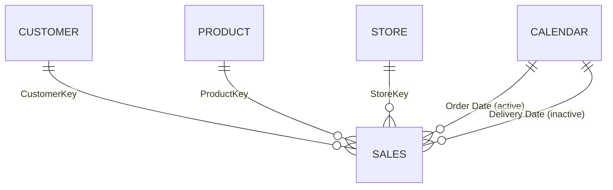

# Sales Semantic Model

## Overview

The Sales semantic model provides shared measures and dimensions for Northwind Retail Group's order-line sales analysis. It supports comparisons by product, customer, store, and date for merchandising and store operations; its measures distinguish net sales, unit volume, product cost, and gross margin dollars.

| Property | Value |
|---|---|
| Source | `sales.SemanticModel/definition` |
| Internal model name | `Model` |
| Storage mode(s) | Import |
| Tables | 5 |
| Measures | 13 |
| Relationships | 5 (4 active, 1 inactive) |
| Compatibility level | 1606 |

The model metadata reports the database and all five partitions as unprocessed / without data. DAX expressions and relationships are documented from metadata, but measure results could not be validated against loaded rows.

## Model Structure



`Sales` is a line-level fact table, identified by order and line number, with product quantity, net price, cost, and order/delivery dates. `Product`, `Customer`, and `Store` provide descriptive attributes; `Calendar` supplies the date, month, quarter, and year breakdowns. Relationships filter from the one-side dimension tables to the many-side `Sales` table (single direction).

The active calendar relationship uses `Sales[Order Date]`. `Sales[Delivery Date]` connects to the same date dimension through an inactive relationship, so delivery-date analysis requires explicitly activating that relationship in a calculation. The `Calendar` table also contains a `Year-Month-Day` hierarchy.

### Fiscal calendar caveat

Northwind Retail Group's company context defines its fiscal year as February through January. The model's generated `Fiscal Year` expression instead increments the year for dates in July through December, implying a July-through-June year. Its `Fiscal Quarter` expression currently yields labels `FQ2` through `FQ5`, rather than four quarters numbered FQ1 through FQ4. Validate these fields before using them for fiscal reporting. Calendar-year measures such as `Sales Amount (LY)` use the model's date column, not these fiscal attributes.

## Tables and Columns

The model does not currently store column descriptions. The business meanings below are concise explanations inferred from column names, data types, and model relationships.

### Calendar

One row per generated date from 2017-01-01 through 2021-12-31. The table is generated in Power Query rather than loaded from an external source.

| Column | Data type | Visibility | Description |
|---|---|---|---|
| Date | DateTime | Hidden | Calendar date used by relationships and time calculations. |
| Year | Int64 | Visible | Calendar year for filtering and grouping. |
| Month | Int64 | Hidden | Numeric calendar month; also sorts Month Name. |
| Month Name | String | Hidden | Abbreviated month label. |
| Quarter | String | Visible | Calendar quarter label. |
| Year-Month | DateTime | Visible | Month-level date for chronological trend analysis. |
| Day | Int64 | Visible | Day of month used in the date hierarchy. |
| Week Number | Int64 | Visible | Week number derived by the Power Query date function. |
| Day of Week | Int64 | Visible | Numeric weekday used to sort Day Name. |
| Day Name | String | Visible | Weekday name. |
| Is Weekend | Boolean | Hidden | Indicates whether the date is a weekend. |
| Fiscal Year | Int64 | Hidden | Generated fiscal year; currently follows a July-through-June boundary, not Northwind's February-through-January convention. |
| Fiscal Quarter | String | Visible | Generated fiscal-quarter label; current expression produces FQ2-FQ5. |

### Sales

One row per sales order line. The relationship keys are hidden; report metrics are intended to use the explicit measures below.

| Column | Data type | Visibility | Description |
|---|---|---|---|
| Order Number | Int64 | Visible | Order identifier shared by the order's line items. |
| Line Number | Int64 | Visible | Line identifier within an order. |
| Order Date | DateTime | Visible | Date used by the active Calendar relationship. |
| Delivery Date | DateTime | Visible | Delivery date connected through an inactive Calendar relationship. |
| CustomerKey | Int64 | Hidden | Customer relationship key. |
| StoreKey | Int64 | Hidden | Store relationship key. |
| ProductKey | Int64 | Hidden | Product relationship key. |
| Unit Cost | Decimal | Hidden | Unit cost used in the Cost and Margin measures. |
| Currency Code | String | Visible | Currency code carried with the sales row. |
| Exchange Rate | Decimal | Visible | Exchange-rate value carried with the sales row. |
| Environment | String | Visible | Environment parameter value added during query processing. |
| Time | DateTime | Visible | Time value added during query processing. |
| Quantity | Int64 | Hidden | Individual product units on the order line. |
| Net Price | Decimal | Hidden | Net unit price used to calculate net sales and margin. |

### Product

One row per product record, with brand, manufacturer, category, and item attributes.

| Column | Data type | Visibility | Description |
|---|---|---|---|
| ProductKey | Int64 | Hidden | Product relationship key. |
| Product Code | String | Visible | Business-facing product code. |
| Product | String | Visible | Product name. |
| Manufacturer | String | Visible | Product manufacturer. |
| Brand | String | Visible | Product brand, including Northwind's house brands where applicable. |
| Color | String | Visible | Product color. |
| Weight Unit Measure | String | Visible | Unit used to express product weight. |
| Weight | Decimal | Visible | Product weight. |
| Unit Cost | Decimal | Visible | Product unit cost attribute. |
| Unit Price | Decimal | Visible | Product unit price attribute; sales revenue measures use `Sales[Net Price]`. |
| Subcategory Code | String | Visible | Product subcategory code. |
| Subcategory | String | Visible | Product subcategory. |
| Category Code | String | Visible | Product category code. |
| Category | String | Visible | Product category. |

### Customer

One row per customer record. Attributes support demographic and geographic breakdowns; no loyalty tier or lifecycle-stage column was found in this model.

| Column | Data type | Visibility | Description |
|---|---|---|---|
| CustomerKey | Int64 | Hidden | Customer relationship key. |
| Customer | String | Visible | Customer name. |
| Gender | String | Visible | Customer gender category supplied by the source. |
| Address | String | Visible | Customer street address. |
| City | String | Visible | Customer city. |
| State Code | String | Visible | Customer state code. |
| State | String | Visible | Customer state or province. |
| Zip Code | String | Visible | Customer postal code. |
| Country Code | String | Visible | Customer country code. |
| Country | String | Visible | Customer country name. |
| Continent | String | Visible | Customer continent. |
| Birthday | DateTime | Visible | Customer birth date. |
| Age | Calculated (DAX; metadata type Unknown) | Visible | Calculated from Birthday and `TODAY()`; the value changes over time. |

### Store

One row per store record, with geography, floor area, opening/closing dates, and status.

| Column | Data type | Visibility | Description |
|---|---|---|---|
| StoreKey | Int64 | Hidden | Store relationship key. |
| Store Code | String | Visible | Business-facing store code. |
| Country | String | Visible | Store country. |
| State | String | Visible | Store state or province. |
| Store | String | Visible | Store name. |
| Square Meters | Int64 | Visible | Store floor area in square meters. |
| Open Date | DateTime | Visible | Store opening date. |
| Close Date | DateTime | Visible | Store closing date, when present. |
| Status | String | Visible | Store status. |

## Measures

All measures respect the active report filter context unless their time logic specifies otherwise. `Revenue` is net sales in Northwind reporting terminology; the model's DAX does not apply currency conversion.

### Sales

#### # Customers (w/ Sales)

Counts distinct customers represented in filtered sales rows, rather than all customer records.

```dax
DISTINCTCOUNT('Sales'[CustomerKey])
```

#### Sales Qty

Totals individual product units sold in the current context. This is unit volume, not transactions or baskets, and is useful alongside revenue during high-volume, lower-margin January clearance.

```dax
SUM('Sales'[Quantity])
```

#### Sales Amount

Calculates net sales by multiplying order-line quantity by net unit price. It represents net rather than gross sales and is the model's revenue basis.

```dax
SUMX('Sales', 'Sales'[Quantity] * 'Sales'[Net Price])
```

#### Sales Amount (LY)

Calculates net sales for the comparable prior-year calendar period. The measure returns a value only when current-context `[Sales Amount]` is greater than zero; it uses `SAMEPERIODLASTYEAR` over `Calendar[Date]`.

```dax
IF (
    [Sales Amount] > 0,
    CALCULATE ( [Sales Amount], SAMEPERIODLASTYEAR ( 'Calendar'[Date] ) )
)
```

#### Sales Amount Avg per Day

Calculates average net sales over the distinct dates in the current calendar context. `AVERAGEX` ignores dates where `[Sales Amount]` is blank.

```dax
AVERAGEX ( VALUES ( 'Calendar'[Date] ), [Sales Amount] )
```

#### Margin

Calculates gross margin dollars as quantity multiplied by net selling price less unit cost. This is a dollar amount, not a margin percentage, and does not include other operating expenses.

```dax
SUMX (
    Sales,
    Sales[Quantity] * ( Sales[Net Price] - Sales[Unit Cost] )
)
```

#### # Sales

Counts rows in the sales fact table. Since the table grain is order line, it is not a distinct order or basket count.

```dax
COUNTROWS ( 'Sales' )
```

#### Sales Amount (12M average)

Calculates average daily net sales across the trailing 12 calendar months ending at the latest selected date. It returns blank when the window begins after the latest order date in the model; it is a rolling calendar window, not a February-January fiscal-year total.

```dax
VAR v_selDate =
    MAX ( 'Calendar'[Date] )
VAR v_period =
    DATESINPERIOD ( 'Calendar'[Date], v_selDate, -12, MONTH )
VAR v_result =
    CALCULATE ( AVERAGEX ( VALUES ( 'Calendar'[Date] ), [Sales Amount] ), v_period )
VAR v_firstDate =
    MINX ( v_period, 'Calendar'[Date] )
VAR v_lastDateSales =
    MAX ( Sales[Order Date] )
RETURN
    IF ( v_firstDate <= v_lastDateSales, v_result )
```

#### Sales Amount (6M average)

Uses the same rolling daily-average logic over the trailing 6 calendar months ending at the latest selected date. It returns blank when the window begins after the latest order date in the model and can help track shorter-term seasonal changes.

```dax
VAR v_selDate =
    MAX ( 'Calendar'[Date] )
VAR v_period =
    DATESINPERIOD ( 'Calendar'[Date], v_selDate, -6, MONTH )
VAR v_result =
    CALCULATE ( AVERAGEX ( VALUES ( 'Calendar'[Date] ), [Sales Amount] ), v_period )
VAR v_firstDate =
    MINX ( v_period, 'Calendar'[Date] )
VAR v_lastDateSales =
    MAX ( Sales[Order Date] )
RETURN
    IF ( v_firstDate <= v_lastDateSales, v_result )
```

#### Cost

Totals line-level product cost as quantity multiplied by unit cost in the current context.

```dax
SUMX ( Sales, Sales[Quantity] * Sales[Unit Cost] )
```

### Product

#### # Products

Counts product records in the current product filter context.

```dax
COUNTROWS ( 'Product' )
```

### Customer

#### # Customers

Counts customer dimension rows in context, whether or not those customers have sales in the selected period. Use `# Customers (w/ Sales)` when the intended count is purchasing customers.

```dax
COUNTROWS ( 'Customer' )
```

### Store

#### # Stores

Counts store dimension rows in the current store filter context.

```dax
COUNTROWS ( 'Store' )
```

### Currency interpretation

The sales rows carry `Currency Code` and `Exchange Rate`, but the listed revenue, cost, and margin expressions do not use either field to convert values. The model also has differing display format strings between measures (including dollar and euro formats); those formats do not perform conversion. Confirm the intended reporting currency before comparing or consolidating amounts.

## Security

No row-level or object-level security roles were found in the model metadata. The company context notes that country-level access restrictions are typical for regional managers, but no corresponding role is currently defined here.

## Data Sources and Refresh

All five tables use one Import-mode Power Query partition each. `Product`, `Customer`, `Store`, and `Sales` load CSV files (`RAW-Product.csv`, `RAW-Customer.csv`, `RAW-Store.csv`, and `RAW-Sales.csv`) from the base URL held in the `HttpSource` parameter. `Environment` is a text parameter with DEV, QUAL, and PRD values; `Randomizer` is a numeric parameter set to 0.6. The Sales query adds the environment value and generates randomized time, quantity, and net-price values using `Randomizer`.

`Calendar` is generated locally in Power Query for 2017-2021, inclusive. Model metadata currently reports all partitions as `NoData` and the database as `Unprocessed`, so refresh and measure-result behavior have not been verified against loaded data.
